# Deep Travel Agent

An intelligent travel planning companion built with LangGraph and Next.js that orchestrates end-to-end trip planning through a single AI agent coordinating specialized tools.

## Project Foundation

This application is built upon LangChain's prebuilt agent chat UI foundation, created using:

```bash
npx create-agent-chat-app@latest
```

The foundation provides a solid base for agent-UI interactions, which was then extended with custom travel planning capabilities. See the [LangGraph.js Full-Stack Quickstart](https://langchain-ai.github.io/langgraphjs/#full-stack-quickstart) for more details on the underlying architecture.

## Architecture Overview

```mermaid
graph TB
    User[👤 User] --> WebUI[🌐 Next.js UI<br/>LangChain Prebuilt Base]
    WebUI --> LangGraphServer[🤖 LangGraph Agent<br/>Travel Coordinator]

    LangGraphServer --> MemoryStore[(💾 Memory Saver<br/>Conversation State)]
    LangGraphServer --> ItineraryStore[(📝 Itinerary Store<br/>File + In-Memory)]

    LangGraphServer --> FlightTools[✈️ Flight Tools<br/>Duffel API]
    LangGraphServer --> HotelTools[🏨 Hotel Tools<br/>SerpAPI]
    LangGraphServer --> ActivityTools[🎯 Activity Tools<br/>SerpAPI + Weather]
    LangGraphServer --> ItineraryTools[📋 Itinerary Tools<br/>State Management]
    LangGraphServer --> SearchTools[🔍 Search Tools<br/>Tavily API]

    FlightTools --> DuffelAPI[Duffel Flight API]
    HotelTools --> SerpAPI[SerpAPI Hotels]
    ActivityTools --> SerpAPI
    ActivityTools --> WeatherAPI[Weather API]
    SearchTools --> TavilyAPI[Tavily Search API]

    classDef agent fill:#ff6b6b,stroke:#333,stroke-width:2px,color:#fff
    classDef tools fill:#4ecdc4,stroke:#333,stroke-width:2px,color:#fff
    classDef storage fill:#45b7d1,stroke:#333,stroke-width:2px,color:#fff
    classDef external fill:#96ceb4,stroke:#333,stroke-width:2px,color:#fff
    classDef ui fill:#feca57,stroke:#333,stroke-width:2px,color:#333

    class LangGraphServer agent
    class FlightTools,HotelTools,ActivityTools,ItineraryTools,SearchTools tools
    class MemoryStore,ItineraryStore storage
    class DuffelAPI,SerpAPI,WeatherAPI,TavilyAPI external
    class User,WebUI ui
```



## Key Architectural Decisions

### 1. Single Agent vs Multi-Agent Architecture

**Decision**: Single orchestrator agent with specialized tools  
**Rationale**: Tool orchestration, not agent orchestration

- **Tools**: Search flights, hotels, activities (simple functions)
- **Agent**: Decision maker that calls tools
- Creating separate agents for each tool would be like hiring 3 managers to each press one button - unnecessary abstraction
- Simpler coordination, reduced complexity, better performance

### 2. State Management Strategy

**Decision**: File-based persistence with in-memory caching  
**Implementation**:

- Itinerary state persisted to JSON files in `/itinerary/` directory
- In-memory Map for fast access during conversation
- Session-based state management with unique trip IDs

### 3. Memory and Autonomy

**Decision**: MemorySaver checkpoint system with recursion limit of 300  
**Benefits**:

- Conversation continuity across interactions
- Agent autonomy for complex multi-step planning
- User can continue if recursion limit reached
- Prevents infinite loops while allowing deep reasoning

### 4. Tool Orchestration Design

**Decision**: Centralized tool coordination through single agent  
**Tool Categories**:

- **Flight Tools**: Search, filter, and book flights via Duffel Test API
- **Hotel Tools**: Search and filter accommodations via SerpAPI
- **Activity Tools**: Find attractions, restaurants, tours with weather integration
- **Itinerary Tools**: Manage trip state, preferences, and budget tracking
- **Search Tools**: General web search via Tavily for contextual information

### 5. Hotel Location Optimization Strategy

**Decision**: Search activities first to understand geographic clusters → Select centrally located hotel  
**Rationale**: Strategic hotel placement for optimal travel efficiency

- **Approach**: Analyze activity distribution before hotel selection
- **Benefits**: Minimized transportation costs, reduced travel time, cohesive daily itineraries
- **Implementation**: Activity-first planning sequence with geographic clustering analysis
- **Multi-day optimization**: Consider multiple hotels for geographically dispersed itineraries

## Project Structure

```
deep-travel-agent/
├── apps/
│   ├── agents/              # LangGraph AI agents
│   │   └── src/
│   │       ├── react-agent/ # Main travel coordinator agent
│   │       └── tools/       # Specialized travel tools
│   │           ├── flight/      # Duffel API integration
│   │           ├── hotel/       # SerpAPI hotel search
│   │           ├── activities/  # SerpAPI activities + weather
│   │           └── itinerary/   # State management tools
│   └── web/                 # Next.js frontend (LangChain base)
├── langgraph.json          # LangGraph configuration
└── turbo.json             # Turbo monorepo config
```

## Technology Stack

### Agents Application

- **LangGraph**: Agent orchestration framework
- **LangChain**: LLM integration and tooling
- **Anthropic**: Claude model integration
- **TypeScript**: Type safety and development experience
- **Zod**: Schema validation for tool inputs/outputs

### External APIs

- **Duffel API**: Flight search and booking
- **SerpAPI**: Hotel and activity search
- **Weather API**: Weather-based activity recommendations
- **Tavily**: Web search for contextual information

### Web Application (LangChain Base)

- **Next.js 15**: React framework with App Router
- **React 19**: Latest React features
- **Tailwind CSS**: Styling framework
- **Radix UI**: Accessible component primitives
- **Framer Motion**: Animation library

## Setup Instructions

### Prerequisites

- Node.js 18+
- npm 9+

### Environment Variables

Copy `.env.example` to `.env` and configure:

```bash
# Required API Keys
TAVILY_API_KEY=your-tavily-key          # Web search functionality
ANTHROPIC_API_KEY=your-anthropic-key    # Claude model access
DUFFEL_API_KEY=your-duffel-key         # Flight search
SERPAPI_KEY=your-serpapi-key           # Hotel and activity search

# Optional: LangSmith tracing
LANGCHAIN_API_KEY=your-langsmith-key
LANGCHAIN_TRACING_V2=true
LANGCHAIN_PROJECT=deep-travel-agent
```

### Development

1. **Install dependencies**:

   ```bash
   npm install
   ```

2. **Start development servers**:

   ```bash
   npm run dev
   ```

   This starts both agents (port 2024) and web (port 3000) concurrently.

3. **Access the application**:
   - Web UI: http://localhost:3000
   - LangGraph API: http://localhost:2024

### Available Commands

#### Root Level

- `npm run dev` - Start both apps concurrently
- `npm run build` - Build all applications
- `npm run lint` - Run linting across workspaces
- `npm run lint:fix` - Fix linting issues
- `npm run format` - Format code across workspaces

#### Agents App (`apps/agents`)

- `npm run dev` - Start LangGraph dev server (port 2024)
- `npm run build` - Clean and compile TypeScript
- `npm run lint` - Run ESLint on source

#### Web App (`apps/web`)

- `npm run dev` - Start Next.js development server
- `npm run build` - Build Next.js application
- `npm run start` - Start production server

## Key Features

### Intelligent Trip Planning

- **End-to-end orchestration**: From initial request to finalized itinerary
- **Multi-modal search**: Flights, hotels, activities, restaurants
- **Weather integration**: Activity recommendations based on conditions
- **Budget tracking**: Real-time cost calculation and per-person breakdown

### State Management

- **Persistent itineraries**: JSON file storage with in-memory caching
- **Session continuity**: Conversation memory across interactions
- **Incremental updates**: Add, modify, or remove trip components
- **Validation**: Schema-validated state transitions

### Tool Coordination

- **Autonomous planning**: Agent runs to completion with 300 recursion limit
- **Error recovery**: Graceful handling of API failures with fallbacks
- **Structured outputs**: JSON responses for programmatic integration
- **User preferences**: Dietary restrictions, accessibility, budget constraints

## Extension Points

### Adding New Tools

1. Create tool implementation in `apps/agents/src/tools/[category]/`
2. Define Zod schemas for input validation
3. Export tools array from `tools.ts`
4. Import and include in main `TOOLS` array

### Customizing the Agent

- **Prompts**: Modify `apps/agents/src/react-agent/prompts.ts`
- **Models**: Update configuration in `apps/agents/src/react-agent/configuration.ts`
- **Behavior**: Adjust graph logic in `apps/agents/src/react-agent/graph.ts`

### UI Customization

The web application is built on LangChain's prebuilt foundation but can be customized:

- **Components**: Extend base components in `apps/web/src/components/`
- **Styling**: Modify Tailwind configuration
- **Features**: Add travel-specific UI elements

## Contributing

1. Follow the existing code structure and patterns
2. Add tests for new tools and functionality
3. Update documentation for architectural changes
4. Ensure TypeScript types are properly defined
5. Test end-to-end workflows before submitting

## License

Apache 2.0 License

---

Built using [LangGraph.js](https://langchain-ai.github.io/langgraphjs/).
