# LangGraph.js Travel Coordinator Agent

A specialized ReAct agent built on LangGraph.js that orchestrates end-to-end travel planning through intelligent tool coordination. This agent extends the base LangGraph ReAct template with custom travel planning capabilities.

## Foundation & Extensions

### LangGraph ReAct Template Base
Built upon the official LangGraph.js ReAct agent template, providing:

- **ReAct Pattern**: Reason-Act-Observe loop for complex problem solving
- **Tool Integration**: Structured tool calling with type safety
- **Memory Management**: Conversation state persistence
- **Streaming Support**: Real-time response streaming
- **Configuration**: Flexible model and prompt configuration

### Travel Domain Extensions
The base template was extended with travel-specific capabilities:

- **Custom Tool Suite**: Flight, hotel, activity, and itinerary management tools
- **Travel-Optimized Prompts**: Domain-specific reasoning patterns
- **State Orchestration**: Multi-step trip planning workflows
- **Weather Integration**: Context-aware activity recommendations
- **Budget Tracking**: Real-time cost calculation and management

## Architecture

### Agent Graph Structure

```mermaid
graph TD
    Start([User Request]) --> Agent[Travel Coordinator Agent]
    Agent --> Memory[(MemorySaver<br/>Checkpoint)]
    Agent --> Tools{Tool Selection}
    
    Tools --> FlightTools[✈️ Flight Tools]
    Tools --> HotelTools[🏨 Hotel Tools] 
    Tools --> ActivityTools[🎯 Activity Tools]
    Tools --> ItineraryTools[📋 Itinerary Tools]
    Tools --> SearchTools[🔍 Search Tools]
    
    FlightTools --> ToolResponse[Tool Response]
    HotelTools --> ToolResponse
    ActivityTools --> ToolResponse
    ItineraryTools --> ToolResponse
    SearchTools --> ToolResponse
    
    ToolResponse --> Agent
    Agent --> Decision{Continue?}
    Decision -->|Yes| Tools
    Decision -->|No| Response([Final Response])
    
    Memory --> Agent
    Agent --> Memory
```


### Core Components

#### Graph Definition (`graph.ts`)
- **ReAct Agent**: Created using `createReactAgent` from LangGraph prebuilt
- **Tool Integration**: All travel tools registered with the agent
- **Memory Persistence**: MemorySaver for conversation continuity
- **Autonomy Configuration**: 100 recursion limit for complex planning
- **Interruption Handling**: Disabled for autonomous operation

#### Tool Orchestration (`tools.ts`)
```typescript
export const TOOLS = [
  searchTavily,          // Web search capabilities
  ...FLIGHT_TOOLS,       // Flight search and booking
  ...HOTEL_TOOLS,        // Hotel search and filtering
  ...ACTIVITY_TOOLS,     // Activities, restaurants, attractions
  ...ITINERARY_TOOLS,    // State management and persistence
];
```

#### Prompt Engineering (`prompts.ts`)
- **Role Definition**: Travel Coordinator agent persona
- **Planning Loop**: Structured approach to trip planning
- **Tool Coordination**: Guidelines for tool selection and usage
- **Autonomy Instructions**: Self-correction and error handling
- **Output Formatting**: Structured response patterns

## Tool Coordination Strategy

### Single Agent Architecture
**Design Decision**: One orchestrator agent with specialized tools
- **Benefits**: Simplified coordination, reduced complexity, better performance
- **Rationale**: Tools are simple functions; agents are decision makers
- **Alternative Avoided**: Multi-agent setup would create unnecessary overhead

### Tool Categories

#### 1. Flight Tools (`../tools/flight/`)
- **Search Tools**: One-way, round-trip, multi-city flight search
- **Integration**: Duffel API for real-time flight data
- **Capabilities**: Price filtering, schedule optimization, airline preferences
- **Output**: Structured flight options with pricing and schedules

#### 2. Hotel Tools (`../tools/hotel/`)
- **Search & Filter**: Location-based hotel search with filters
- **Integration**: SerpAPI for comprehensive hotel data
- **Capabilities**: Price range, amenities, ratings, property details
- **Persistence**: Search results cached for filtering operations

#### 3. Activity Tools (`../tools/activities/`)
- **Multi-Category Search**: Attractions, restaurants, tours, activities
- **Weather Integration**: Context-aware recommendations
- **Integration**: SerpAPI + Weather API
- **Capabilities**: Category filtering, rating-based selection, weather suitability

#### 4. Itinerary Tools (`../tools/itinerary/`)
- **State Management**: Trip data persistence and retrieval
- **Structure**: Day-by-day planning with morning/afternoon/evening slots
- **Capabilities**: Add/remove activities, budget tracking, finalization
- **Storage**: File-based persistence with in-memory caching

#### 5. Search Tools
- **General Search**: Tavily API for contextual information
- **Use Cases**: Destination research, travel requirements, local information

### Tool Coordination Patterns

#### Sequential Planning
```typescript
// Example planning flow
1. start_itinerary        // Initialize trip structure
2. search_flights         // Find flight options
3. search_hotels          // Find accommodation
4. search_activities      // Find things to do
5. add_activity           // Populate itinerary
6. set_accommodation      // Assign hotels
7. summarize_budget       // Calculate costs
8. finalize_itinerary     // Complete planning
```

#### Error Recovery
- **Tool Failures**: Automatic retry with corrected parameters
- **API Limits**: Fallback strategies and graceful degradation
- **Invalid Inputs**: Schema validation and self-correction
- **Partial Results**: Continue with available data

## State Management

### Memory System
```typescript
const checkpointSaver = new MemorySaver();
```

- **Conversation Continuity**: Maintains context across interactions
- **Decision History**: Tracks reasoning and tool calls
- **Recovery**: Resume interrupted planning sessions
- **Performance**: Efficient checkpoint storage and retrieval

### Itinerary Persistence
- **File Storage**: JSON files in `/itinerary/` directory
- **In-Memory Cache**: Fast access during conversation
- **Session Management**: Unique trip IDs for state isolation
- **Incremental Updates**: Add/modify/remove trip components

### Recursion Management
```typescript
export const graph = agent.withConfig({ recursionLimit: 100 });
```

- **Autonomous Operation**: Agent continues until task completion
- **Deep Planning**: Handles complex multi-step workflows
- **User Override**: Continue button if limit reached
- **Loop Prevention**: Structured reasoning prevents infinite loops

## Configuration

### Model Selection (`configuration.ts`)
```typescript
export const ConfigurationSchema = Annotation.Root({
  systemPromptTemplate: Annotation<string>,
  model: Annotation<string>,
});
```

**Default Model**: `google-genai/gemini-2.5-flash`
**Alternatives**: Anthropic Claude, OpenAI GPT-4, other LangChain-supported models

### Prompt Customization
The system prompt includes:
- **Role Definition**: Travel Coordinator persona
- **Planning Methodology**: Step-by-step approach
- **Tool Usage Guidelines**: When and how to use each tool
- **Output Formatting**: Structured response patterns
- **Error Handling**: Recovery strategies and fallbacks

## Development

### Local Development
```bash
# Start LangGraph development server
npm run dev

# The agent will be available at:
# http://localhost:2024/agent
```

### Testing the Agent
```bash
# Example test requests
curl -X POST http://localhost:2024/threads/test-123/runs \
  -H "Content-Type: application/json" \
  -d '{"messages": [{"role": "user", "content": "Plan a 3-day trip to Paris"}]}'
```

### Adding New Tools

#### 1. Create Tool Implementation
```typescript
// apps/agents/src/tools/new-category/tools.ts
export const newTool = new DynamicStructuredTool({
  name: "new_tool",
  description: "Tool description",
  schema: NewToolSchema,
  func: async (params) => {
    // Tool implementation
  },
});
```

#### 2. Register with Agent
```typescript
// apps/agents/src/react-agent/tools.ts
import { NEW_TOOLS } from "../tools/new-category/tools.js";

export const TOOLS = [
  // ... existing tools
  ...NEW_TOOLS,
];
```

#### 3. Update Prompts
Add tool usage guidelines to `prompts.ts`:
```typescript
export const SYSTEM_PROMPT_TEMPLATE = `
// ... existing prompt
- Use new_tool for specific use case
- When to call vs other tools
// ... rest of prompt
`;
```

## Advanced Features

### Autonomous Planning
- **Run-to-Completion**: Agent continues until trip is fully planned
- **Self-Correction**: Automatically fixes schema validation errors
- **Fallback Strategies**: Handles API failures gracefully
- **Progress Tracking**: Validates completeness before finishing

### Structured Outputs
- **JSON Responses**: Tool outputs in structured format
- **Schema Validation**: Zod schemas ensure data consistency
- **Type Safety**: Full TypeScript support throughout
- **Error Handling**: Graceful handling of malformed data

### Performance Optimizations
- **Tool Caching**: Reuse search results for filtering
- **Lazy Loading**: Load tools only when needed
- **Memory Management**: Efficient checkpoint storage
- **API Rate Limiting**: Built-in request throttling

## Monitoring & Debugging

### LangSmith Integration
```bash
# Enable tracing
LANGCHAIN_TRACING_V2=true
LANGCHAIN_API_KEY=your-key
LANGCHAIN_PROJECT=travel-agent
```

### Debug Information
- **Tool Calls**: Trace all tool invocations
- **Reasoning Steps**: Monitor agent decision-making
- **Error Tracking**: Capture and analyze failures
- **Performance Metrics**: Response times and success rates

### Common Issues

#### Tool Schema Errors
- **Symptom**: Tool calls fail with validation errors
- **Solution**: Check Zod schema definitions and tool inputs
- **Prevention**: Use TypeScript for compile-time checking

#### Memory Issues
- **Symptom**: Agent loses context between interactions
- **Solution**: Verify MemorySaver configuration
- **Prevention**: Test checkpoint persistence regularly

#### Infinite Loops
- **Symptom**: Agent exceeds recursion limit
- **Solution**: Review prompt logic and tool selection criteria
- **Prevention**: Add explicit termination conditions

## Extension Points

### Custom Reasoning Patterns
Modify the ReAct loop in `graph.ts` for specialized workflows:
- **Parallel Tool Calls**: Execute multiple tools simultaneously
- **Conditional Logic**: Add decision nodes for complex branching
- **Human Feedback**: Re-enable interruptions for user input

### Integration with External Systems
- **CRM Integration**: Connect to customer management systems
- **Payment Processing**: Add booking and payment capabilities
- **Notification Systems**: Send updates via email/SMS
- **Analytics**: Track usage patterns and success rates

---

Built on LangGraph.js ReAct template with extensive travel domain customizations for intelligent trip orchestration.